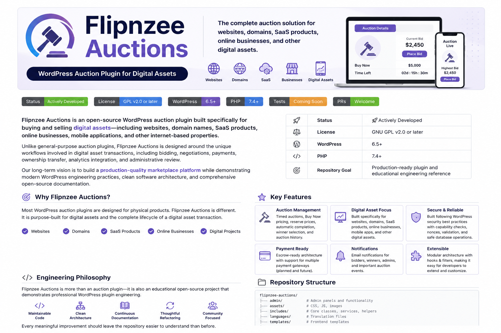

<p align="center">
  
</p>

<div align="center">

### WordPress Auction Plugin for Digital Assets

*A secure, extensible, and developer-friendly WordPress auction plugin built specifically for websites, domains, SaaS products, online businesses, and other digital assets.*

</div>

---

Flipnzee Auctions is an open-source WordPress auction plugin built specifically for buying and selling digital assets...

# Flipnzee Auctions

### WordPress Auction Plugin for Digital Assets

Flipnzee Auctions is an open-source WordPress auction plugin built specifically for buying and selling digital assets—including websites, domain names, SaaS products, online businesses, mobile applications, and other internet-based properties.

Unlike general-purpose auction plugins, Flipnzee Auctions is designed around the unique workflows involved in digital asset transactions, including bidding, negotiations, payments, ownership transfer, analytics integration, and administrative review.

Our long-term vision is to build a production-quality marketplace platform while demonstrating modern WordPress engineering practices, clean software architecture, and comprehensive open-source documentation.

---

| | |
|---|---|
| **Status** | 🚧 Actively Developed |
| **License** | GNU GPL v2.0 or later |
| **WordPress** | 6.5+ |
| **PHP** | 7.4+ |
| **Repository Goal** | Production-ready plugin and educational engineering reference |

---

# Why Flipnzee Auctions?

Most WordPress auction plugins are designed for physical products.

Flipnzee Auctions is different.

It is purpose-built for digital assets such as:

- Websites
- Domain Names
- SaaS Products
- Online Businesses
- Mobile Applications
- Digital Projects
- Internet Properties

The plugin focuses on the complete lifecycle of a digital asset transaction—from listing and bidding to payment, ownership transfer, and future analytics integration.

---

# Key Features

## Auction Management

- Timed auctions
- Buy Now pricing
- Reserve prices
- Automatic auction completion
- Winner selection
- Auction history

## Digital Asset Focus

- Website sales
- Domain auctions
- SaaS businesses
- Digital products
- Online business acquisitions

## Administration

- Dedicated auction dashboard
- Auction management
- Payment tracking
- Transaction records
- Administrative review workflow

## Security

- WordPress capability checks
- Nonce verification
- Secure database operations
- Input validation
- Output escaping
- WordPress Coding Standards

## Extensible Architecture

- Modular design
- Action hooks
- Filters
- Future REST API support
- Future payment gateways
- Analytics integration

---

# Engineering Philosophy

Flipnzee Auctions is more than an auction plugin.

It is also an educational open-source project that demonstrates professional WordPress plugin engineering.

Throughout development we aim to:

- Build maintainable software
- Keep architecture easy to understand
- Improve documentation continuously
- Refactor responsibly
- Follow WordPress Coding Standards
- Explain engineering decisions
- Keep contributors in mind

Every meaningful improvement should leave the repository easier to understand than before.

---

# Repository Structure

```
flipnzee-auctions/

admin/
assets/
includes/

CHANGELOG.md
LICENSE
README.md
ROADMAP.md
flipnzee-auctions.php
```

As the project grows, additional documentation will be added under a dedicated `docs/` directory when meaningful content is available.

---

# Current Development Focus

Current engineering priorities include:

- Architecture refactoring
- Code quality improvements
- Documentation expansion
- Payment abstraction
- Auction lifecycle improvements
- Frontend enhancements
- Administrative improvements
- Analytics integration
- REST API foundation
- Accessibility improvements

---

# Roadmap

The long-term roadmap includes:

- Improved software architecture
- Service-oriented organization
- Escrow integration
- Multiple payment gateways
- Notification framework
- Analytics integration
- REST API
- Developer documentation
- Testing framework
- GitHub Actions
- Continuous Integration
- Static Analysis
- Automated Releases

See **ROADMAP.md** for project planning.

---

# Open Source Documentation

Documentation is treated as part of the product.

As the repository grows, documentation will cover:

- Plugin Architecture
- Bootstrap Process
- Database Schema
- Auction Lifecycle
- Payment System
- Security Model
- Scheduled Events
- Frontend Architecture
- Admin Architecture
- Development Workflow

Documentation will be added incrementally as each subsystem matures.

---

# Contributing

Contributions are welcome.

Whether you'd like to:

- report a bug
- improve documentation
- fix an issue
- propose a feature
- improve code quality

your contributions are appreciated.

Contribution guidelines will continue evolving alongside the project.

---

# License

Flipnzee Auctions is licensed under the **GNU General Public License v2.0 or later**.

See the **LICENSE** file for details.

---

# About This Project

Flipnzee Auctions began as a specialized WordPress auction plugin but has grown into a long-term engineering project.

Our goal is not only to build a capable auction platform, but also to create an open-source repository that demonstrates thoughtful software architecture, maintainable code, and high-quality engineering documentation.

Rather than simply asking:

> "What feature should we build next?"

we regularly ask:

> **"If a new developer joined this project today, what would they need to understand next?"**

That mindset guides every architectural improvement, documentation update, and engineering decision made throughout the project.
